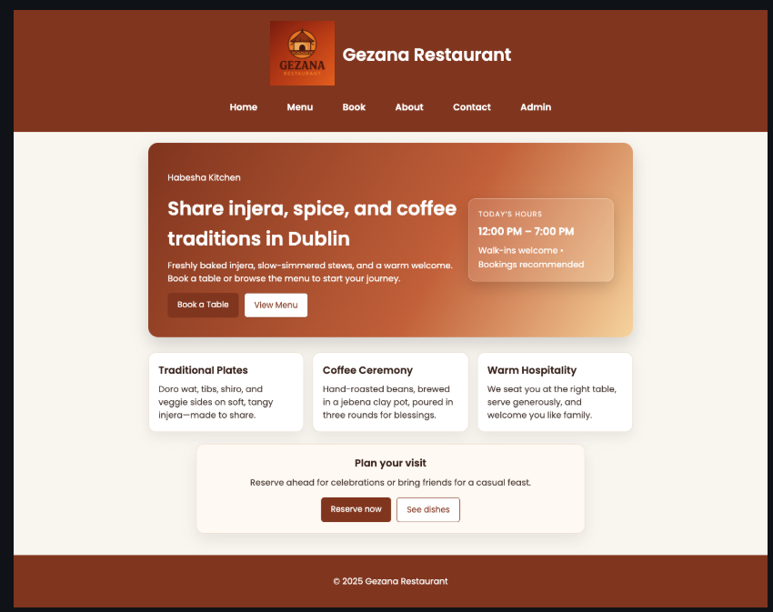
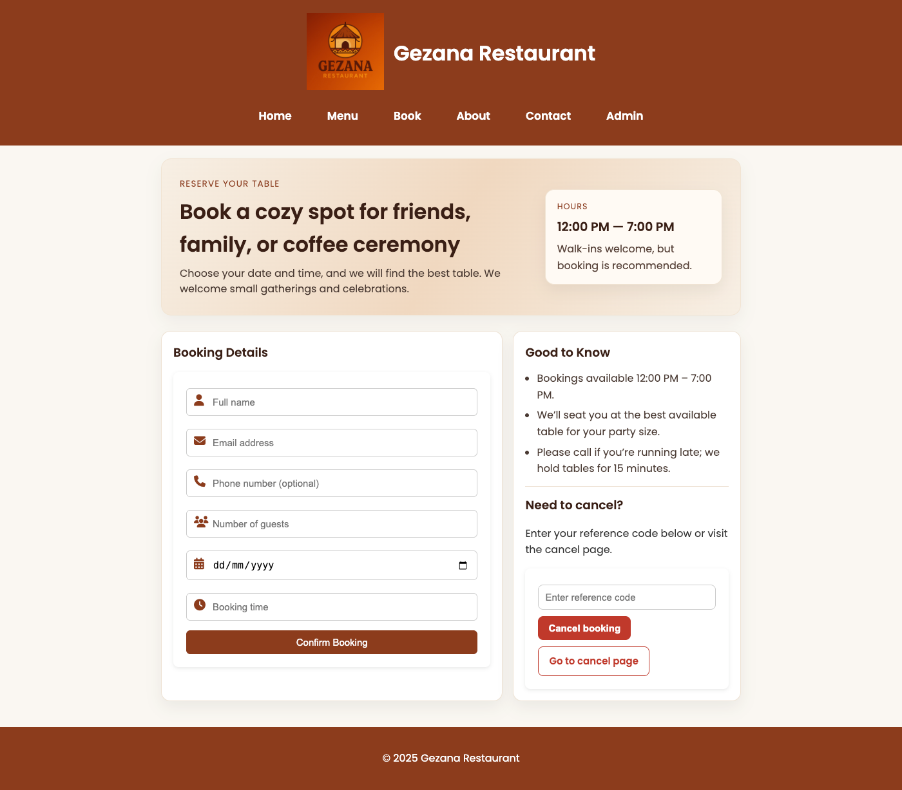
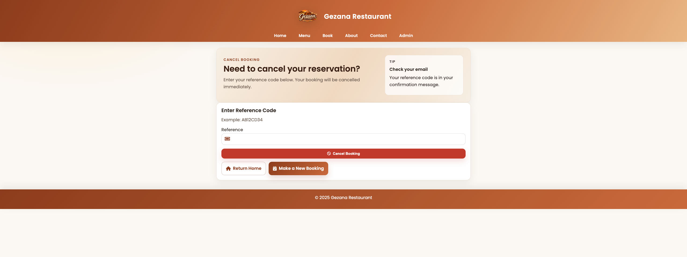
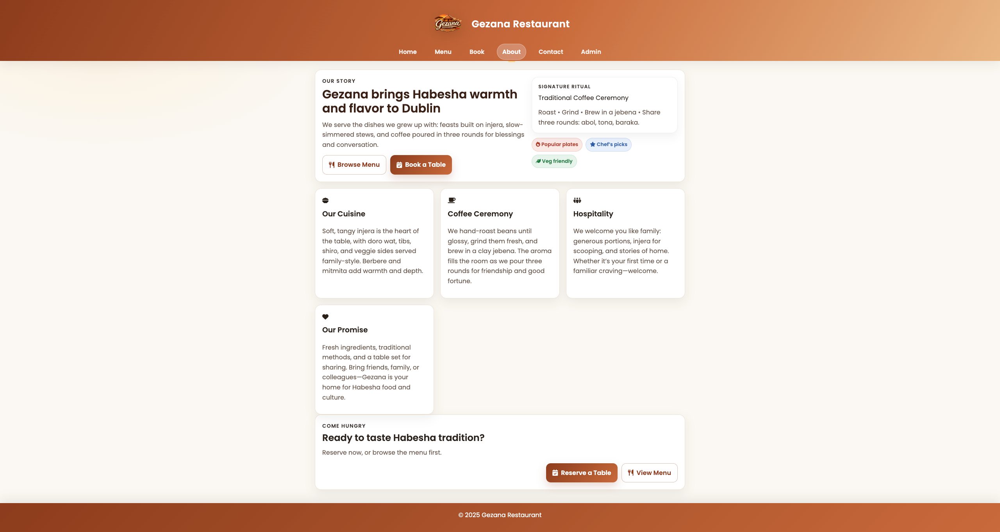
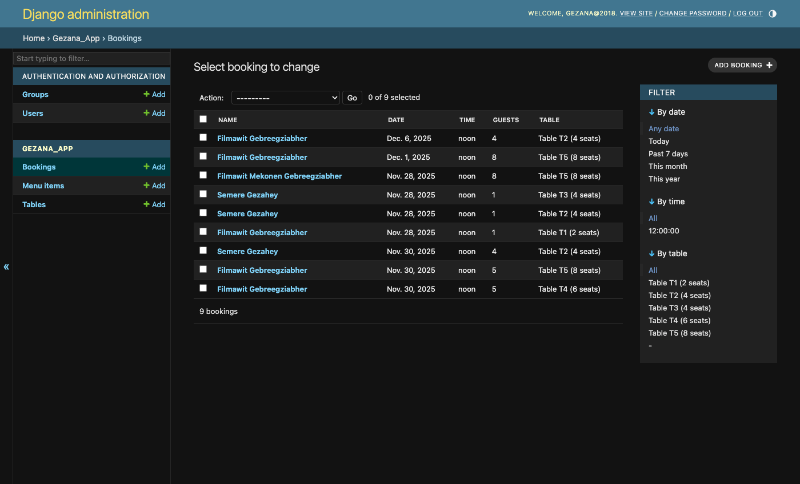
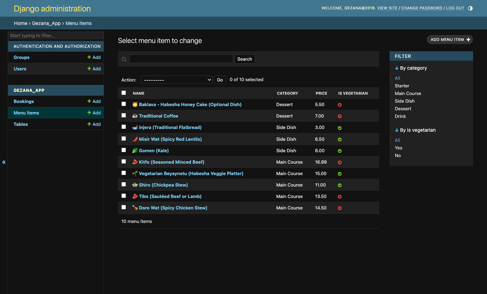
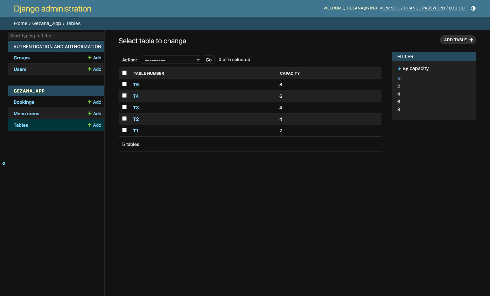
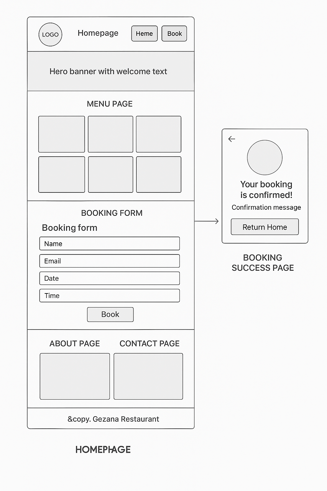
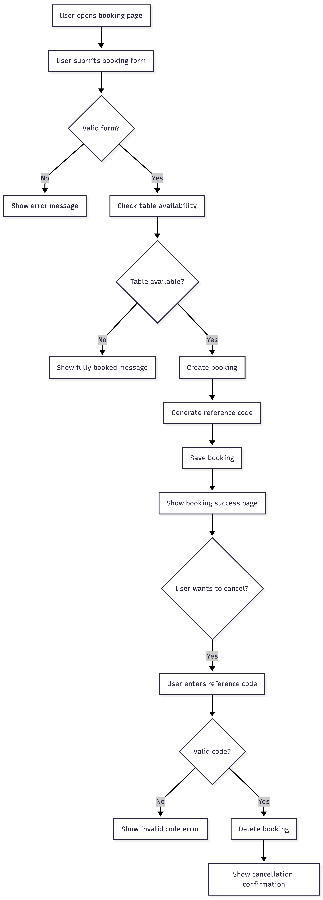
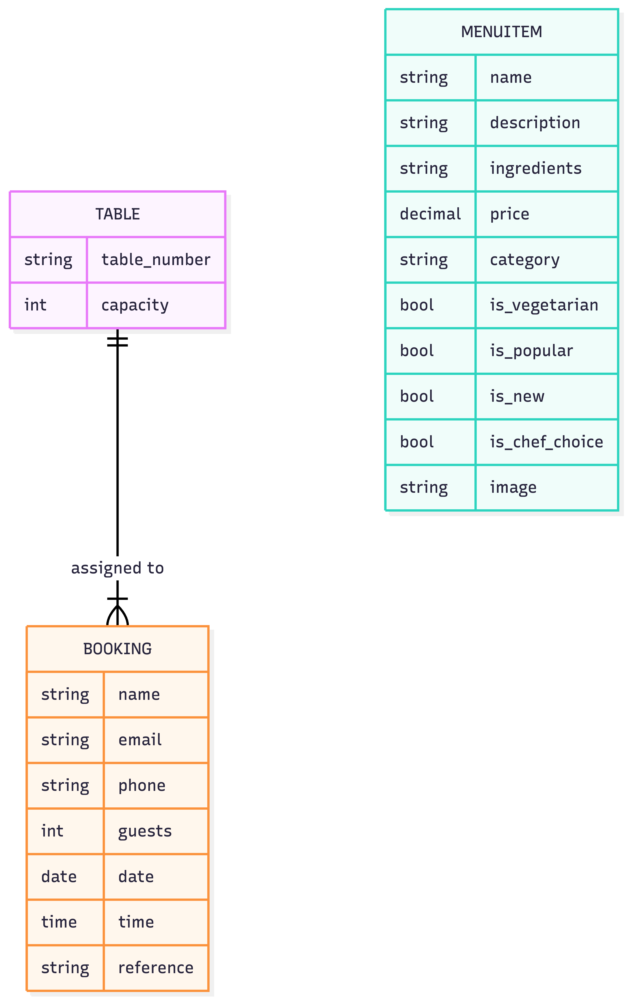

# Gezana – Habesha Restaurant Booking System  
*A full-stack Django project for restaurant bookings, menu display, cancellations, and customer interaction.*

---

## 1. Overview

Gezana is a full-stack Django web application for a Habesha (Ethiopian & Eritrean) restaurant based in Dublin.  
It provides:

- Online table booking with validation and automated table assignment  
- Double-booking prevention and duplicate-contact checks  
- Booking cancellation using a unique reference code  
- Menu display by category with dietary badges and detail pages  
- About, Contact (with map embed), and stylistic homepage sections  
- Admin management for menu items, tables, and bookings  

This project targets the assessment criteria for Back End Development (Level 5) by delivering a fully functional, database-backed, full-stack Django app with CRUD, validation, testing, and deployment documentation.

---

## 2. Project Goals

### External User Goals
- Browse the restaurant’s menu  
- Book a table quickly and easily  
- Receive confirmation and a unique cancellation code  
- Cancel bookings using their reference code  
- Learn more about Gezana and how to contact us  

### Site Owner Goals
- Receive accurate booking information  
- Prevent double bookings for the same table/time  
- Manage menu items without editing code  
- Allow customers to reach the restaurant easily  
- Organize tables, menu items, and bookings via Django admin  

### Rationale & Audience
- Audience: diners seeking Habesha cuisine in Dublin; staff managing tables and menu content.  
- Purpose: provide an intuitive booking flow, clear feedback, and operational control via Django admin.  
- UX approach: consistent layout, responsive grid, high contrast buttons, alt text on images, clear form labels/placeholders, and immediate messaging for success/error states.

---

## 3. Features

### ✔ Homepage
- Hero with CTAs to book or view menu  
- Highlights for cuisine, coffee ceremony, hospitality, and visit planning  
- “Plan your visit” CTA with supporting image  

### ✔ Menu Page
- Menu grid with badges (Veg/New/Popular/Chef) and price tags  
- Individual dish detail page  
- Uses uploaded images with graceful fallback  
- All items editable via Django admin  

### ✔ Booking System
- Name, email, phone, guests, date, time  
- Prevents past date bookings  
- Ensures valid opening hours  
- Allocates appropriate table automatically  
- Avoids double bookings  
- Shows success message  
- Generates unique booking reference code  
- Sends styled email confirmations (booking and cancellation)  

### ✔ Cancellation System
- Enter reference code to cancel booking  
- Booking removed from database  
- Error message for invalid code  

### ✔ About Page
- Restaurant story  
- Cultural background  
- Mission  

### ✔ Contact Page
- Location, email, phone  
- Opening times  

### ✔ Admin Area
- Add/edit/delete menu items  
- Create tables and set capacities  
- View and manage bookings  
- Filters, search, ordering  

---

## 4. Final Design Screenshots
Place your captured screenshots in `docs/screenshots/` and update the filenames below if needed.

  
  
  
  
  
  

### Admin Page
  
  
  

---

## 5. Wireframe
Place the wireframe image in `docs/wireframes/` (update the filename if different).



---

## 6. Technologies Used

### Languages
- Python  
- HTML  
- CSS  

### Frameworks & Libraries
- Django  
- Django Messages Framework  

### Tools
- Git & GitHub  
- VS Code  
- Heroku  
- PostgreSQL  
- Cloudinary  
- WhiteNoise  

---

## 7. User Stories

### As a user:
- I want to view the menu to see what dishes are available.  
- I want to book a table for a specific date/time.  
- I want to receive confirmation that my booking is successful.  
- I want to cancel my booking if my plans change.  
- I want to see clear feedback if a booking fails.  
- I want to read about the restaurant.  
- I want to find contact information.  

### As a site owner:
- I want to manage menu items easily.  
- I want to avoid double bookings.  
- I want customers to book online without calling.  
- I want users to cancel their own bookings.  
- I want access to all booking data in admin.  

---

## 8. Database Schema

### Table Model
| Field        | Type              | Notes |
|--------------|-------------------|-------|
| table_number | CharField (uniq)  | Human-friendly ID |
| capacity     | PositiveInteger   | Seats per table |

### MenuItem Model
| Field          | Type         | Notes |
|----------------|--------------|-------|
| name           | CharField    | Dish name |
| description    | TextField    | Dish summary |
| ingredients    | TextField    | Defaults to placeholder |
| price          | DecimalField | max_digits=6, decimal_places=2 |
| category       | ChoiceField  | starter, main, side, dessert, drink |
| is_vegetarian  | Boolean      | Veg badge |
| is_popular     | Boolean      | Popular badge |
| is_new         | Boolean      | New badge |
| is_chef_choice | Boolean      | Chef badge |
| image          | ImageField   | Optional upload |

### Booking Model
| Field     | Type         | Notes |
|-----------|--------------|-------|
| name      | CharField    | Guest name |
| email     | EmailField   | Used to prevent duplicate same-day bookings |
| phone     | CharField    | Optional, also used for duplicate checks |
| guests    | PositiveInt  | Party size |
| date      | DateField    | Date picker |
| time      | TimeField    | Validated 12:00–19:00 |
| table     | ForeignKey   | Assigned table or null |
| reference | CharField    | Unique 8-char code, auto-generated |

---

## 9. CRUD & Data Operations
- **Create**: Booking form creates bookings with validation and auto table assignment; admin can create menu items, tables, and bookings.  
- **Read**: Public menu list/detail; bookings read internally for availability checks; admin list views.  
- **Update**: Admin edits menu items, tables, bookings.  
- **Delete**: Cancel booking form deletes by reference; admin can delete any model.  
- **Immediate feedback**: Django messages show success/error; form-level validation for time window, past dates, duplicate contact on same date, and slot availability.

---

## 10. UX, Accessibility & Styling
- Responsive layout (grid/flex) across home, menu, booking, about, contact.  
- High-contrast primary buttons; ghost variants for secondary actions.  
- Semantic headings, alt text on images (including menu fallback), and clear labels/placeholders.  
- Form validation with inline error messages for blocking conditions.  
- Keyboard focusable links/buttons; no hover-only critical actions.  
- Contact page includes map embed; About and Menu use descriptive sectioning.  
- Home and Menu heroes use gradients; cards with consistent spacing to avoid overlap.

---

## 11. Testing

### Manual Testing Summary

| Feature          | Test Performed                               | Result |
|------------------|-----------------------------------------------|--------|
| Booking          | Prevent past date                            | Pass   |
| Booking          | Prevent double booking                       | Pass   |
| Booking          | Valid bookings show success message          | Pass   |
| Cancellation     | Valid reference cancels booking              | Pass   |
| Cancellation     | Invalid reference shows error                | Pass   |
| Navigation       | All links route correctly                    | Pass   |
| Templates        | All extend base.html correctly               | Pass   |
| Form Validation  | Guests/date/time validated                   | Pass   |

## Booking System Tests

### 1. Valid Booking
**Input:** Valid name, email, guests, date, time  
**Expected:** Booking confirmation + reference code  
**Result:** Pass  

### 2. Double Booking Prevention
**Scenario:** Two users try to book same table/time  
**Expected:** Second user gets error  
**Result:** Pass  

### 3. Invalid Date
| Input | Expected | Result |
|-------|----------|--------|
| Past date | Error message | Pass |
| 31/11/2025 | Validation error | Pass |

### 4. Invalid Time
| Time | Expected | Result |
|------|----------|--------|
| 05:00 | “Invalid time” | Pass |
| 23:30 | Out-of-hours error | Pass |

---

## Cancellation Tests

### 1. Valid Reference
**Input:** Real reference code  
**Expected:** Booking deleted, success message  
**Result:** Pass  

### 2. Invalid Reference
**Input:** Random letters  
**Expected:** “Invalid cancellation code.”  
**Result:** Pass  

---

## Menu Page Testing

| Test | Expected | Result |
|------|----------|--------|
| Menu items display | All items visible | Pass |
| Category field | Human-readable format | Pass |
| “Vegetarian” tag | Correctly shown | Pass |
| Item details | Correct info loads | Pass |

---

## Template Testing

| Template | Inherits from base.html? | Pass |
|----------|---------------------------|------|
| home.html | Yes | ✔ |
| menu_list.html | Yes | ✔ |
| menu_detail.html | Yes | ✔ |
| booking_success.html | Yes | ✔ |
| cancel_booking.html | Yes | ✔ |

---

## Python Code Testing (PEP8)
Checked using: pycodestyle .

| File | Errors Found | Status |
|------|--------------|--------|
| views.py | 0 | Pass |
| models.py | 0 | Pass |
| forms.py | 0 | Pass |
| urls.py | 0 | Pass |

---

## Browser Compatibility
| Browser | Result |
|---------|--------|
| Chrome | Pass |
| Safari | Pass |
| Firefox | Pass |
| Mobile iOS Safari | Pass |
| Mobile Android Chrome | Pass |

---

## Final Result

All core functionalities passed manual and validator testing.

### Validators
- HTML — W3C validator  
- CSS — Jigsaw validator  
- Python — PEP8 compliant  

---

### Validators
- HTML — W3C validator  
- CSS — Jigsaw validator  
- Python — PEP8 compliant  

---

## 12. Deployment (Heroku)

### Required environment variables
Copy `.env.example` to `.env` (for local) and set the same keys in Heroku Config Vars:

- `SECRET_KEY` — unique per deployment  
- `DEBUG` — `False` in production  
- `ALLOWED_HOSTS` — comma-separated list of domains  
- `DATABASE_URL` — automatically provided by Heroku Postgres add-on  
- `CLOUDINARY_URL` — provided by Cloudinary dashboard  

### Steps
1. Push code to GitHub.  
2. Create a Heroku app.  
3. Add **Heroku Postgres** add-on.  
4. Set Config Vars (`SECRET_KEY`, `DEBUG`, `ALLOWED_HOSTS`, `CLOUDINARY_URL`).  
5. Deploy using `git push heroku main`.  
6. Run migrations: `heroku run python manage.py migrate`.  
7. Create a superuser: `heroku run python manage.py createsuperuser`.  
8. Open the site: `heroku open`.

---

## 13. Running Locally

```bash
git clone https://github.com/fila2021/Gezana.git
cd Gezana
python3 -m venv venv
source venv/bin/activate
pip install -r requirements.txt
python3 manage.py migrate
python3 manage.py runserver
```

---
## 14. MoSCoW Prioritisation

The MoSCoW method was used to prioritise features based on importance and project scope.

### Must Have
These features are essential for the application to meet its core purpose:
- Users can view the menu  
- Users can book a table  
- Double-booking is prevented  
- Users receive a booking confirmation  
- Users can cancel a booking using a reference code  
- Admin can manage menu items, tables, and bookings  

### Should Have
These features significantly improve usability and user experience:
- Clear success and error messages  
- Responsive layout across devices  
- Contact details page  

### Could Have
These features are desirable but not critical for the current release:
- Customer reviews  
- Online payment integration  

### Won’t Have (for now)
These features are outside the current project scope:
- Food delivery system  
- Multi-language support  

---

## 15. Full User Story Table

| ID | As a… | I want to… | So I can… |
|----|--------|-------------|------------|
| 1 | User | View the menu | Decide what to eat |
| 2 | User | Book a table online | Reserve a spot easily |
| 3 | User | See booking confirmation | Know my booking succeeded |
| 4 | User | Cancel my booking | Change plans easily |
| 5 | User | Learn about the restaurant | Understand its background |
| 6 | User | Find contact information | Call/email the restaurant |
| 7 | Owner | Prevent double bookings | Avoid conflicts |
| 8 | Owner | Manage menu items via admin | Update dishes easily |
| 9 | Owner | Assign tables automatically | Reduce mistakes |
| 10 | Owner | Receive accurate customer details | Contact customers if needed |

---

## 16. Features Overview

### Implemented Features

#### ✔ Menu System
- Menu list with badges (vegetarian, new, popular, chef’s choice) and price tags  
- Dish detail page  
- Image support with fallback for missing images  
- Fully admin-controlled content  

#### ✔ Booking System
- Booking form with validation  
- Date and time validation  
- Automatic table assignment based on capacity  
- Double-booking prevention  
- Success message after booking  
- Unique reference code generation  

#### ✔ Cancellation System
- Cancellation via reference code  
- Booking removal from database  
- Error handling for invalid references  

#### ✔ Static Pages
- About page  
- Contact page  

#### ✔ Admin Management
- Manage tables  
- Manage menu items  
- Manage bookings  

---

## 17. Flowchart – Booking & Cancellation



## 18. ERD – Database Structure



## 19. Bugs & Fixes

Throughout development and deployment, several issues were encountered and resolved. These fixes improved stability, usability, and production readiness.

| Bug | Cause | Fix |
|-----|-------|-----|
| Templates collapsing into one line | VS Code auto-formatting | Disabled formatters and added workspace settings |
| Unclosed tag errors | Template minification | Rewrote templates with correct block structure |
| Date validation error | Incorrect user input | Added date picker widget and server-side validation |
| Booking success message missing | Messages block missing | Added Django messages to `base.html` |
| Menu detail page returning 404 | Menu item not created | Added test data via Django admin |
| Cancel booking always invalid | Reference case mismatch | Normalised reference input using `.upper()` |
| Menu images missing on Heroku | Ephemeral file system | Integrated Cloudinary for media storage |
| App crash on startup | Conflicting storage settings | Removed `DEFAULT_FILE_STORAGE` when using `STORAGES` |
| Admin errors after deploy | Migrations not applied | Ran migrations on Heroku production database |

---

## 20. Future Enhancements

Planned improvements to extend functionality and enhance user experience include:

1. User authentication with booking history  
2. Automated email notifications for bookings and cancellations  
3. Online payment integration for reservations  
4. Customer review and rating system  
5. Visual table layout / floor plan  
6. Analytics dashboard for admin users  
7. Multi-language support for broader accessibility  

---

## 21. Security & Configuration

Security and configuration best practices were followed throughout development:

- Sensitive data is managed using environment variables and excluded from version control  
- `DEBUG` is set to `False` in production  
- `ALLOWED_HOSTS` configured appropriately for deployment environments  
- Django admin protected by authentication and staff permissions  
- CSRF protection enabled on all forms  
- Django ORM used to prevent SQL injection  
- Media handling configured safely using Cloudinary in production  

---

## 22. Reflection

This project has been a comprehensive learning experience that strengthened my backend development, frontend design, and deployment skills. It allowed me to build a full-featured Django application while addressing real-world usability and production challenges.

### What Went Well
- Built a complete CRUD system using Django models, forms, views, and templates.
- Implemented real-world booking logic, including past date/time prevention, seating capacity checks, and double-booking avoidance.
- Developed a clear and user-friendly booking flow enhanced with Django’s messages framework.
- Designed a responsive menu system with category-based filtering and recommended items.
- Improved overall UI consistency across desktop and mobile through iterative refinement.
- Successfully deployed the application to Heroku with stable production behaviour.

### Challenges Faced
- Menu filtering initially returned all items due to mismatched category values between models and templates.
- A text-based search input appeared functional but did not filter results correctly.
- Mobile navigation styling broke during UI refactoring and lacked an active-page indicator.
- Recommended menu items displayed even when filters were applied, causing confusion.
- Media files were not persistent on Heroku, leading to missing images in production.
- GitHub and Heroku push errors occurred when large files were accidentally committed.
- CSS grew complex over time, causing layout conflicts and inconsistent styling.

### How I Solved Them
- Simplified menu filtering by removing the non-functional text search and filtering by category only.
- Replaced dropdown filters with category card buttons to improve clarity and usability.
- Updated view logic so recommended items only appear when no filters are active.
- Fixed mobile navigation layout and added a visible active state for the current page.
- Refactored and cleaned the CSS to remove duplication and maintain a consistent design system.
- Switched media storage to Cloudinary to ensure persistent image handling in production.
- Removed large files from Git history and added proper `.gitignore` rules.
- Debugged deployment issues effectively using `heroku logs --tail`.

### What I Learned
- Small inconsistencies between frontend templates and backend logic can silently break core features.
- Simplifying functionality often leads to better reliability and user experience.
- Mobile-first testing is essential, as many issues only appear on smaller screens.
- Clean, maintainable CSS is critical as a project grows.
- Incremental commits make debugging, rollbacks, and deployment far easier.
- Proper environment configuration and media storage are essential for production-ready Django apps.

### Next Steps
- Add user accounts so customers can view and manage their bookings.
- Introduce pagination or lazy loading for larger menus.
- Add automated tests for booking validation and menu filtering.
- Further improve accessibility (ARIA labels, keyboard navigation).
- Explore online ordering functionality for future expansion.
---

## 23. Recent Updates (Media & Deployment Improvements)

During the final deployment phase, the following improvements were implemented:

- Integrated Cloudinary for persistent menu image uploads on Heroku.
- Fixed `DEFAULT_FILE_STORAGE` vs `STORAGES` conflicts that caused application crashes.
- Added graceful fallback images for menu items without uploaded photos.
- Added favicon support to eliminate production 404 requests.
- Removed large files that were blocking GitHub pushes.
- Updated deployment settings and verified application stability using Heroku logs.
- Fixed menu category filtering to ensure only relevant items are displayed.
- Removed the non-functional text search bar and simplified filtering to category selection only.
- Replaced dropdown filters with clear, clickable category cards.
- Ensured recommended menu items only appear when no category filter is active.
- Improved mobile navigation layout and added a visible active-page indicator.
- Refined booking page layout to improve form spacing and usability on mobile.
- Cleaned and refactored CSS to remove duplication and resolve layout conflicts.
- Restored a simpler, cleaner home page design while keeping consistent styling.
- Verified all changes across desktop and mobile to ensure responsive behaviour.

---

## 24. Credits

- Code Institute  
- Django Documentation  
- Heroku Documentation  
- Cloudinary Documentation  
- Royalty-free images sourced from open-license platforms  
- All content, design, and development by the project author 

---

# ✨ Thank You For Visiting Gezana!

Proudly sharing Habesha culture through food and technology.
