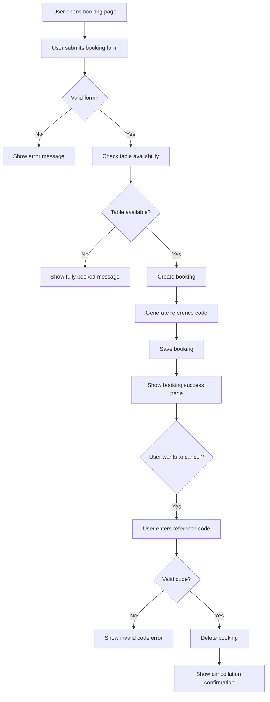
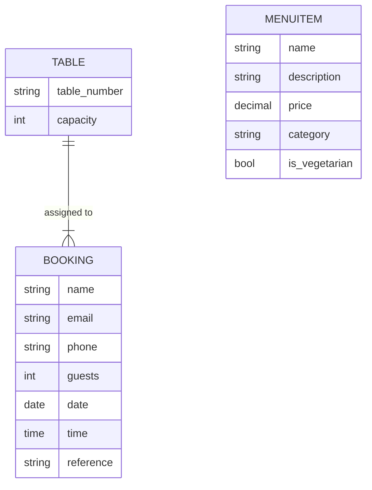

# Gezana – Habesha Restaurant Booking System  
*A full-stack Django project for restaurant bookings, menu display, cancellations, and customer interaction.*

---

## 1. Overview

Gezana is a full-stack Django web application for a Habesha (Ethiopian & Eritrean) restaurant based in Dublin.  
It provides:

- Online table booking  
- Automatic table assignment  
- Double-booking prevention  
- Booking cancellation with a reference code  
- Menu display with categories  
- About & Contact information  
- Admin management system  

This project was developed for the Code Institute Full Stack Software Development Diploma (Milestone Project 3).

---

## 2. Project Goals

### External User Goals
- Browse the restaurant’s menu  
- Book a table quickly and easily  
- Receive confirmation and a unique cancellation code  
- Cancel bookings using their reference code  
- Learn more about Gezana and how to contact us  

### Site Owner Goals
- Receive accurate booking information  
- Prevent double bookings for the same table/time  
- Manage menu items without editing code  
- Allow customers to reach the restaurant easily  
- Organize tables, menu items, and bookings via Django admin  

---

## 3. Features

### ✔ Homepage
- Clean introduction  
- Navigation to Menu, Book, Cancel, About, Contact  

### ✔ Menu Page
- Menu items displayed by category  
- Individual dish detail page  
- Vegetarian flag  
- All items editable via Django admin  

### ✔ Booking System
- Name, email, phone, guests, date, time  
- Prevents past date bookings  
- Ensures valid opening hours  
- Allocates appropriate table automatically  
- Avoids double bookings  
- Shows success message  
- Generates unique booking reference code  

### ✔ Cancellation System
- Enter reference code to cancel booking  
- Booking removed from database  
- Error message for invalid code  

### ✔ About Page
- Restaurant story  
- Cultural background  
- Mission  

### ✔ Contact Page
- Location, email, phone  
- Opening times  

### ✔ Admin Area
- Add/edit/delete menu items  
- Create tables and set capacities  
- View and manage bookings  
- Filters, search, ordering  

---

## 4. Technologies Used

### Languages
- Python  
- HTML  
- CSS  

### Frameworks & Libraries
- Django  
- Django Messages Framework  

### Tools
- Git & GitHub  
- VS Code  
- Render (deployment)  

---

## 5. User Stories

### As a user:
- I want to view the menu to see what dishes are available.  
- I want to book a table for a specific date/time.  
- I want to receive confirmation that my booking is successful.  
- I want to cancel my booking if my plans change.  
- I want to see clear feedback if a booking fails.  
- I want to read about the restaurant.  
- I want to find contact information.  

### As a site owner:
- I want to manage menu items easily.  
- I want to avoid double bookings.  
- I want customers to book online without calling.  
- I want users to cancel their own bookings.  
- I want access to all booking data in admin.  

---

## 6. Database Schema

### Table Model
| Field         | Type        |
|---------------|-------------|
| table_number  | CharField   |
| capacity      | Integer     |

### MenuItem Model
| Field         | Type          |
|---------------|---------------|
| name          | CharField     |
| description   | TextField     |
| price         | DecimalField  |
| category      | ChoiceField   |
| is_vegetarian | BooleanField  |

### Booking Model
| Field     | Type          |
|-----------|---------------|
| name      | CharField     |
| email     | EmailField    |
| phone     | CharField     |
| guests    | Integer       |
| date      | DateField     |
| time      | TimeField     |
| table     | ForeignKey    |
| reference | CharField     |

---

## 7. Testing

### Manual Testing Summary

| Feature          | Test Performed                               | Result |
|------------------|-----------------------------------------------|--------|
| Booking          | Prevent past date                            | Pass   |
| Booking          | Prevent double booking                       | Pass   |
| Booking          | Valid bookings show success message          | Pass   |
| Cancellation     | Valid reference cancels booking              | Pass   |
| Cancellation     | Invalid reference shows error                | Pass   |
| Navigation       | All links route correctly                    | Pass   |
| Templates        | All extend base.html correctly               | Pass   |
| Form Validation  | Guests/date/time validated                   | Pass   |

# Testing Documentation

## Manual Testing

### Navigation
| Action | Expected Result | Outcome |
|--------|------------------|---------|
| Click “Home” | Homepage loads | Pass |
| Click “Menu” | Menu list displayed | Pass |
| Click “Book” | Booking form appears | Pass |
| Click “Cancel Booking” | Cancellation form loads | Pass |
| Click “About” | About page loads | Pass |
| Click “Contact” | Contact page loads | Pass |

---

## Booking System Tests

### 1. Valid Booking
**Input:** Valid name, email, guests, date, time  
**Expected:** Booking confirmation + reference code  
**Result:** Pass  

### 2. Double Booking Prevention
**Scenario:** Two users try to book same table/time  
**Expected:** Second user gets error  
**Result:** Pass  

### 3. Invalid Date
| Input | Expected | Result |
|-------|----------|--------|
| Past date | Error message | Pass |
| 31/11/2025 | Validation error | Pass |

### 4. Invalid Time
| Time | Expected | Result |
|------|----------|--------|
| 05:00 | “Invalid time” | Pass |
| 23:30 | Out-of-hours error | Pass |

---

## Cancellation Tests

### 1. Valid Reference
**Input:** Real reference code  
**Expected:** Booking deleted, success message  
**Result:** Pass  

### 2. Invalid Reference
**Input:** Random letters  
**Expected:** “Invalid cancellation code.”  
**Result:** Pass  

---

## Menu Page Testing

| Test | Expected | Result |
|------|----------|--------|
| Menu items display | All items visible | Pass |
| Category field | Human-readable format | Pass |
| “Vegetarian” tag | Correctly shown | Pass |
| Item details | Correct info loads | Pass |

---

## Template Testing

| Template | Inherits from base.html? | Pass |
|----------|---------------------------|------|
| home.html | Yes | ✔ |
| menu_list.html | Yes | ✔ |
| menu_detail.html | Yes | ✔ |
| booking_success.html | Yes | ✔ |
| cancel_booking.html | Yes | ✔ |

---

## Python Code Testing (PEP8)
Checked using: pycodestyle .

| File | Errors Found | Status |
|------|--------------|--------|
| views.py | 0 | Pass |
| models.py | 0 | Pass |
| forms.py | 0 | Pass |
| urls.py | 0 | Pass |

---

## Browser Compatibility
| Browser | Result |
|---------|--------|
| Chrome | Pass |
| Safari | Pass |
| Firefox | Pass |
| Mobile iOS Safari | Pass |
| Mobile Android Chrome | Pass |

---

## Final Result

All core functionalities passed manual and validator testing.

### Validators
- HTML — W3C validator  
- CSS — Jigsaw validator  
- Python — PEP8 compliant  

---

## 8. Deployment (Render)

### Steps:
1. Push project to GitHub  
2. Create a *Web Service* on Render  
3. Connect GitHub repository  
4. Build command:

pip install -r requirements.txt
5. Start command:

gunicorn gezana.wsgi
6. Add environment variables:
- `SECRET_KEY`  
- `DEBUG=False`  
7. Run migrations:

python3 manage.py migrate
8. Collect static files:

python3 manage.py collectstatic
App will deploy and become live.
---
## 9. Running Locally
Clone the repo:
git clone https://github.com/fila2021/Gezana.git
cd Gezana
Create virtual environment:
python3 -m venv venv
source venv/bin/activate
Install dependencies:
pip install -r requirements.txt
Run migrations:
python3 manage.py migrate
Start server:
python3 manage.py runserver
Visit:
http://127.0.0.1:8000/

---

## 10. User Stories

## MoSCoW Prioritisation

### Must Have
- Users can view the menu
- Users can book a table
- Double-booking is prevented
- Users receive a booking confirmation
- Users can cancel booking using a reference code
- Admin can manage menu, tables and bookings

### Should Have
- Clear success/error messages
- Responsive layout
- Contact details page

### Could Have
- Customer reviews
- Online payment integration

### Won’t Have (for now)
- Food delivery system
- Multi-language support

---

# Full User Story Table

| ID | As a… | I want to… | So I can… |
|----|--------|-------------|------------|
| 1 | User | View the menu | Decide what to eat |
| 2 | User | Book a table online | Reserve a spot easily |
| 3 | User | See booking confirmation | Know my booking succeeded |
| 4 | User | Cancel my booking | Change plans easily |
| 5 | User | Learn about the restaurant | Understand its background |
| 6 | User | Find contact information | Call/email the restaurant |
| 7 | Owner | Prevent double bookings | Avoid conflicts |
| 8 | Owner | Manage menu items via admin | Update dishes easily |
| 9 | Owner | Assign tables automatically | Reduce mistakes |
| 10 | Owner | Receive accurate customer details | Contact customers if needed |

## 11. FEATURES
# Features Overview

## Implemented Features

### ✔ Menu System
- Menu list
- Dish detail page
- Vegetarian flag
- Admin-controlled content

### ✔ Booking System
- Booking form
- Date/time validation
- Automatic table assignment
- Double-booking prevention
- Success message
- Unique reference code

### ✔ Cancellation System
- Enter reference code
- Cancel booking
- Error handling

### ✔ Static Pages
- About page
- Contact page

### ✔ Admin Management
- Tables
- Menu Items
- Bookings

---

## Future Enhancements

- User accounts & booking history  
- Email notifications for bookings  
- Online payment system  
- Restaurant table map  
- Reviews/testimonials  

## 12. Flowchart – Booking & Cancellation

## 13. ERD – Database Structure

## 14. Bugs & Fixes

| Bug | Cause | Fix |
|-----|-------|-----|
| Templates collapsing into one line | VS Code auto-formatting | Disabled formatters, added workspace settings |
| Unclosed tag errors | Template being minified | Rewrote templates with correct blocks |
| Date validation error | User input wrong format | Added date picker widget |
| Booking success not showing message | Missing messages block | Added Django messages to base.html |
| Menu detail page 404 | Item not created in admin | Created test items |
| Cancel booking always invalid | Reference not uppercase | Normalised `.upper()` on input |

## 15. Future Enhancements

1. User authentication for booking history  
2. Email notifications for booking + cancellation  
3. Online payment for reservations  
4. Review and rating system  
5. Menu images  
6. Table map / floor plan  
7. Admin dashboard with stats  

## 16. Credits

- Code Institute  
- Django Documentation  
- All content and development by the project author  

---

# ✨ Thank You For Visiting Gezana!

Proudly sharing Habesha culture through food and technology.

