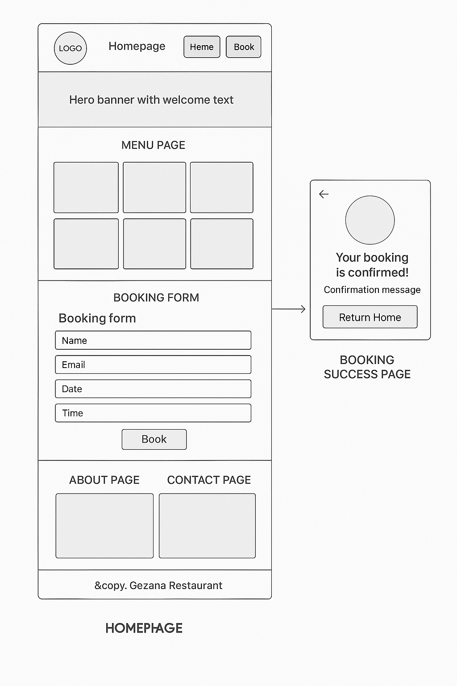
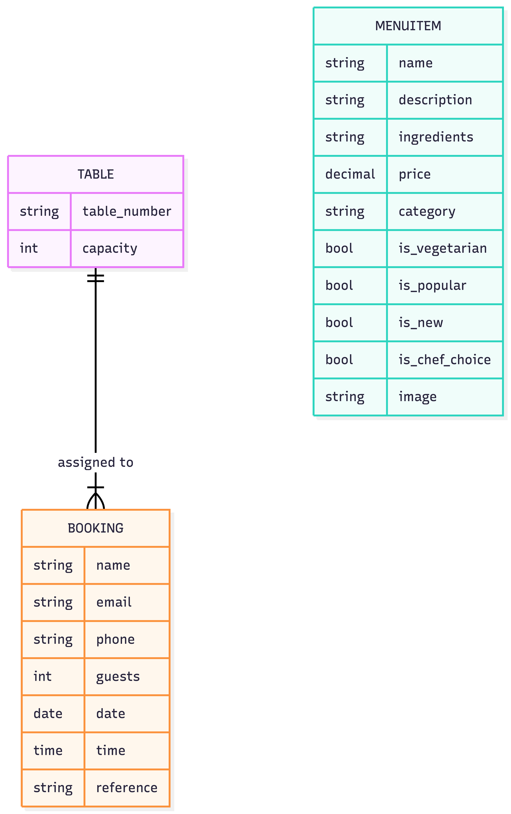
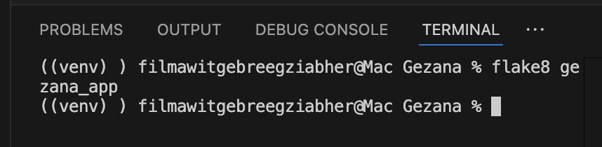

# Gezana – Habesha Restaurant Booking System

A full-stack Django web application that allows customers to browse a restaurant menu, book tables online, manage reservations, and cancel bookings using a unique reference code.

This project was developed as part of the **Data Centric Development (Full Stack Frameworks with Django)** assessment.

---

# Table of Contents

1. Overview  
2. Live Project  
3. UX & Design  
4. User Stories  
5. Features  
6. Database Design  
7. Technologies Used  
8. Installation & Local Setup  
9. Deployment  
10. Testing  
11. Bugs & Fixes  
12. Future Enhancements  
13. Security Considerations  
14. Reflection  
15. Credits  

---

# 1. Overview

Gezana is a web application designed for a Habesha (Ethiopian & Eritrean) restaurant in Dublin.

The system allows customers to:

- Browse available menu items
- Book tables online
- Receive booking confirmations
- Manage existing bookings
- Cancel bookings using a reference code

The application automatically assigns tables based on party size and prevents double bookings for the same time slot.

The admin interface allows restaurant staff to manage menu items, bookings, and table capacities without modifying code.

---

# 2. Live Project

Live Application  
https://gezana.herokuapp.com

GitHub Repository  
https://github.com/fila2021/Gezana

---

# 3. UX & Design

## Target Users

The main users of this system are:

- Customers who want to book tables
- Customers browsing menu options
- Restaurant staff managing reservations

The design prioritizes:

- Simplicity
- Fast booking process
- Clear feedback messages
- Mobile responsiveness

---

## Design Principles

The interface was designed to ensure:

- Simple navigation
- Clear form labels
- Accessible colour contrast
- Responsive layout across devices
- Minimal steps required to complete bookings

---

## Wireframe

The initial wireframe was created to plan page structure and layout.



---

# 4. User Stories

## As a User

- I want to view the menu so I can decide what to order.
- I want to book a table online so I don't need to call the restaurant.
- I want to receive confirmation that my booking succeeded.
- I want to cancel a booking if my plans change.
- I want to see clear error messages if something goes wrong.
- I want to find contact details for the restaurant.

---

## As a Restaurant Owner

- I want to prevent double bookings.
- I want tables to be assigned automatically.
- I want to manage menu items easily.
- I want customers to cancel bookings themselves.
- I want access to booking data via admin.

---

# 5. Features

## Homepage

- Hero section with call-to-action buttons
- Quick navigation to menu and booking pages
- Information about the restaurant experience

---

## Menu Page

- Displays menu items with images
- Badges for:
  - Vegetarian
  - New
  - Popular
  - Chef’s choice
- Price tags and descriptions
- Individual dish detail pages

Menu items are managed through Django Admin.

---

## Booking System

Customers can:

- Enter name, email, phone number
- Select date and time
- Choose number of guests

Validation ensures:

- Past dates cannot be selected
- Time slots must be within opening hours
- Tables have enough capacity
- Duplicate bookings are prevented

When booking is successful:

- A unique reference code is generated
- Confirmation message is displayed

---

## Manage Booking

Customers can locate their booking by entering:

- Booking reference
- Email or phone number

They can then modify the reservation details.

---

## Cancel Booking

Customers can cancel bookings using their reference code.

If the code is valid:

- Booking is deleted
- Confirmation message appears

If the code is invalid:

- Error message appears

---

## About Page

Provides background information about the restaurant and its cultural heritage.

---

## Contact Page

Displays:

- Address
- Email
- Phone number
- Opening hours
- Embedded Google map

---

## Admin Dashboard

Restaurant staff can:

- Add/edit/delete menu items
- Create and manage tables
- View all bookings
- Search and filter booking data

---

# 6. Database Design

## Table Model

| Field | Type | Description |
|------|------|-------------|
| name | CharField | Table identifier |
| capacity | Integer | Number of seats |

---

## MenuItem Model

| Field | Type |
|------|------|
| name | CharField |
| description | TextField |
| ingredients | TextField |
| price | DecimalField |
| category | ChoiceField |
| is_vegetarian | Boolean |
| is_popular | Boolean |
| is_new | Boolean |
| is_chef_choice | Boolean |
| image | ImageField |

---

## Booking Model

| Field | Type |
|------|------|
| name | CharField |
| email | EmailField |
| phone | CharField |
| guests | Integer |
| date | DateField |
| time | TimeField |
| table | ForeignKey |
| reference | CharField |

Reference codes are automatically generated.

---

## ERD Diagram



---

# 7. Technologies Used

## Languages

- Python
- HTML
- CSS

---

## Frameworks

- Django
- Django ORM
- Django Messages Framework

---

## Tools

- Git
- GitHub
- VS Code
- Heroku
- PostgreSQL
- Cloudinary
- WhiteNoise

---

# 8. Installation & Local Setup

Clone repository

```
git clone https://github.com/fila2021/Gezana.git
```

Navigate into project

```
cd Gezana
```

Create virtual environment

```
python3 -m venv venv
```

Activate environment

```
source venv/bin/activate
```

Install dependencies

```
pip install -r requirements.txt
```

Create `.env` file

```
SECRET_KEY=your-secret-key
DEBUG=True
DATABASE_URL=your-database-url
CLOUDINARY_URL=your-cloudinary-url
```

Run migrations

```
python manage.py migrate
```

Start server

```
python manage.py runserver
```

---

# 9. Deployment

The application is deployed on **Heroku**.

Steps:

1. Create Heroku app
2. Add PostgreSQL add-on
3. Configure environment variables
4. Push project to Heroku
5. Run migrations
6. Create admin user

Commands:

```
git push heroku main
heroku run python manage.py migrate
heroku run python manage.py createsuperuser
```

---

# 10. Testing

Testing was carried out throughout development to ensure all features function correctly and the application behaves as expected.

Testing included:

- Manual functional testing
- Validation testing
- Browser compatibility testing
- Code validation using Flake8
- HTML and CSS validation
- User experience testing

---

# Manual Feature Testing

| Feature | Test Performed | Expected Result | Result |
|--------|---------------|----------------|--------|
| Homepage | Load homepage | Page loads without errors | Pass |
| Navigation | Click all navigation links | Correct pages load | Pass |
| Menu Page | View menu items | Items display correctly | Pass |
| Menu Detail | Click dish | Detail page opens | Pass |
| Booking Form | Submit valid booking | Booking created with reference | Pass |
| Booking Validation | Submit past date | Error message shown | Pass |
| Booking Validation | Submit invalid time | Error message shown | Pass |
| Booking Validation | Duplicate booking attempt | Booking rejected | Pass |
| Manage Booking | Enter valid reference | Booking details retrieved | Pass |
| Manage Booking | Edit booking details | Booking updated | Pass |
| Cancel Booking | Enter valid reference | Booking removed | Pass |
| Cancel Booking | Enter invalid reference | Error message displayed | Pass |
| Admin Dashboard | Login as admin | Admin dashboard loads | Pass |
| Admin Menu Management | Add/edit menu item | Item saved correctly | Pass |
| Admin Table Management | Create table | Table saved | Pass |
| Admin Booking Management | View bookings | Booking list displayed | Pass |

---

# Booking System Testing

### Test 1: Valid Booking

**Input**

- Valid name
- Valid email
- Valid date and time
- Valid number of guests

**Expected Result**

Booking confirmation appears and a reference code is generated.

**Result**

Pass

---

### Test 2: Duplicate Booking Prevention

**Scenario**

Two bookings attempted for the same table and time.

**Expected Result**

Second booking rejected.

**Result**

Pass

---

### Test 3: Invalid Date

| Input | Expected Result | Result |
|------|----------------|--------|
| Past date | Error message | Pass |
| Invalid calendar date | Validation error | Pass |

---

### Test 4: Invalid Time

| Time Input | Expected Result | Result |
|-----------|----------------|--------|
| 05:00 | Out-of-hours error | Pass |
| 23:00 | Out-of-hours error | Pass |

---

# Cancellation System Testing

### Test 1: Valid Reference

**Input**

Valid booking reference code

**Expected Result**

Booking deleted and confirmation message displayed.

**Result**

Pass

---

### Test 2: Invalid Reference

**Input**

Random reference code

**Expected Result**

Error message displayed.

**Result**

Pass

---

# Menu Page Testing

| Test | Expected Result | Result |
|------|----------------|--------|
| Menu items display | All menu items visible | Pass |
| Vegetarian badge | Correctly displayed | Pass |
| Popular badge | Correctly displayed | Pass |
| Dish detail page | Loads correct item information | Pass |

---

# Template Testing

All templates were checked to ensure they extend the base template and load correctly.

| Template | Inherits base.html | Result |
|---------|-------------------|--------|
| home.html | Yes | Pass |
| menu_list.html | Yes | Pass |
| menu_detail.html | Yes | Pass |
| booking_form.html | Yes | Pass |
| booking_success.html | Yes | Pass |
| cancel_booking.html | Yes | Pass |
| about.html | Yes | Pass |
| contact.html | Yes | Pass |

---

# Browser Compatibility Testing

The application was tested on multiple browsers and devices.

| Browser | Result |
|-------|--------|
| Google Chrome | Pass |
| Mozilla Firefox | Pass |
| Safari | Pass |
| Mobile Safari (iOS) | Pass |
| Chrome (Android) | Pass |

---

# Validator Testing

## HTML Validation

All HTML files were validated using the **W3C HTML Validator**.

Result: No errors.

Example validation screenshot:


---

## CSS Validation

All CSS was validated using the **W3C Jigsaw CSS Validator**.

Result: No errors.

Example validation screenshot:


---

## Python Code Validation

Python code was checked using **Flake8** to ensure compliance with PEP8 standards.

Command used:

```
flake8 gezana_app
```

Result: No errors.

Example output screenshot:



---

# Accessibility Testing

Accessibility was considered during development to ensure the website is usable by all users.

Measures implemented include:

- Semantic HTML headings
- Alt text for images
- Form labels for inputs
- Clear error messages
- High contrast buttons
- Keyboard accessible navigation

Accessibility was tested using browser developer tools and manual inspection.

---

# Performance Testing

Performance was reviewed using browser developer tools.

Key observations:

- Pages load quickly due to lightweight templates.
- Static files are served efficiently using WhiteNoise.
- Images are optimized through Cloudinary.

---

# Testing Summary

All core application features were tested successfully.

The booking system, menu system, cancellation process, and admin functionality operate as intended across multiple browsers and devices.

The project passed HTML, CSS, and Python validation checks, ensuring clean and maintainable code.

---

# 11. Bugs & Fixes

| Issue | Cause | Fix |
|-----|-----|-----|
| Booking reference mismatch | Case sensitivity | Converted to uppercase |
| Menu images missing | Heroku ephemeral storage | Integrated Cloudinary |
| Duplicate bookings allowed | Missing validation | Added table availability logic |
| Booking success message missing | Messages block missing | Added messages framework |

---

# 12. Future Enhancements

Planned improvements:

- User accounts
- Booking history
- Online ordering
- Payment integration
- Customer reviews
- Multi-language support

---

# 13. Security Considerations

Security practices implemented:

- Environment variables used for sensitive data
- Django ORM prevents SQL injection
- CSRF protection enabled
- DEBUG disabled in production
- Admin access restricted

---

# 14. Reflection

This project provided valuable experience in building a complete Django web application from design through deployment.

### Key Learning Outcomes

- Designing database-driven applications
- Implementing complex validation logic
- Managing media files in production
- Deploying Django applications to Heroku
- Debugging deployment issues

### Challenges

- Handling table availability logic
- Managing media storage on Heroku
- Debugging CSS layout conflicts

Each issue strengthened my debugging and development workflow.

---

# 15. Credits

Resources used:

- Django Documentation
- Code Institute learning materials
- Heroku Documentation
- Cloudinary Documentation

Images and content used for educational purposes.

Project developed by the author as part of the backend development assessment.

---

# Thank You for Visiting Gezana
Sharing Habesha culture through food and technology.